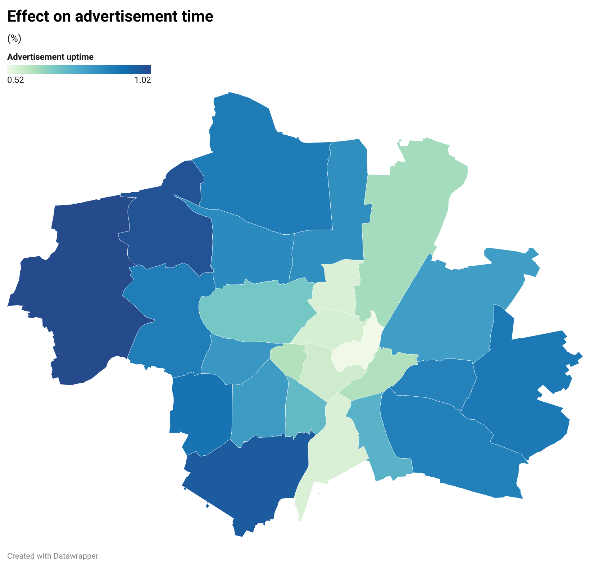
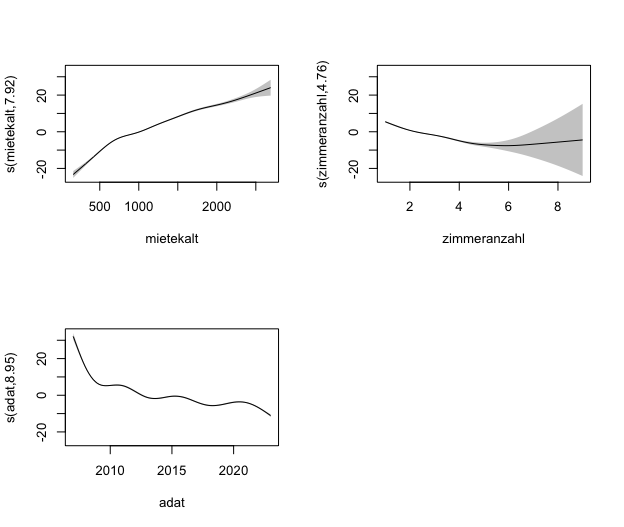

# 🏘️ Immoscout 24 Uptime – an indicator for apartment characteristics in high demand

## 🔍 Overview
This tool predicts rental ad uptimes across Munich districts, helping identify apartments which are in high demand with their associated properties. By analyzing Immobilienscout24 listings alongside municipal and geospatial data, we provide insights which districts rent out fast and what kind of apartments should be built in such areas.

## ✨ Features
* **Predictive Analytics**: Light Gradient-Boosting Machine to forecast rental ad uptimes across Munich districts
* **Interactive Map Interface**: OpenStreetMap integration for intuitive geospatial data exploration (WIP)
* **Temporal Filtering**: Analyze property characteristics by years to identify evolving trends
* **District-Level Insights**: Detailed breakdown of rental preferences by Munich neighborhood

## 🛠️ Technology Stack
* **Backend**: Python with scikit-learn for predictive modeling
* **Frontend**: React.js with OpenStreetMap integration for interactive visualization
* **Data Sources**:
   * Immobilienscout24 rental ad panel data
   * Municipal data from [BERD Platform](https://berd-platform.de/records/g39xd-nxz07)
   * 100m grid data from [BERD Platform](https://berd-platform.de/records/gkpfe-xjb82)
   * Additional datasets from Munich's Open Data platform

## 👥 Stakeholders
* Municipalities
* Construction Companies / Real Estate Developers

## 🧠 Assumptions
* Shorter ad uptimes indicate higher demand for properties with those characteristics
* Rental patterns differ significantly across Munich districts
* Property features that correlate with fast rentals reflect actual market preferences
* Historical rental data can predict future rental market behavior

## 📊 Project Outcomes
Our analysis successfully identifies rental market patterns across Munich, highlighting:
* Properties with shortest uptimes (most desirable) by district
* Correlations between property features and market demand
* Spatial patterns in rental preferences across the city
* Year-over-year evolution of renters' preferences
  

  
  

  
  

## 🚀 Installation & Usage
We provided a requirements.txt to set up the environment.

## 👨‍💻 Contributors
[Simon Drauz](https://github.com/simondrauz)
[Fanni Büki](https://github.com/bukifanni)
[Florian Korn](https://github.com/flo1166)
